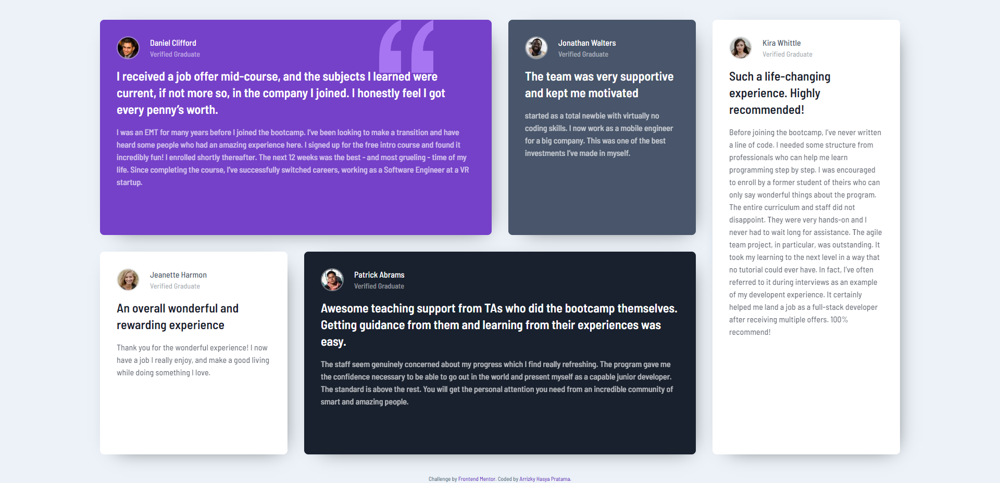

# Frontend Mentor - Testimonials grid section solution

This is a solution to the [Testimonials grid section challenge on Frontend Mentor](https://www.frontendmentor.io/challenges/testimonials-grid-section-Nnw6J7Un7). Frontend Mentor challenges help you improve your coding skills by building realistic projects.

## Table of contents

- [Overview](#overview)
  - [The challenge](#the-challenge)
  - [Screenshot](#screenshot)
  - [Links](#links)
- [My process](#my-process)
  - [Built with](#built-with)
- [Author](#author)

## Overview

### The challenge

Users should be able to:

- View the optimal layout for the site depending on their device's screen size

### Screenshot

[📱 Mobile Version](./mobile.png)

### Links

- 📌 Solution URL: [Solution](https://github.com/arrizkyhp/fm-testimonials-grid-section)
- 🎪 Live Site URL: [Live Site](https://fm-testimonials-grid-section-one.vercel.app/)

### Built with

- Semantic HTML5 markup
- Flexbox
- CSS Grid
- [TailwindCss](https://tailwindcss.com/) - CSS framework
- [NextJS](https://nextjs.org/) - React framework
- [Scss](https://sass-lang.com/) - CSS extension

## Author

- Github - [arrizkyhp](https://github.com/arrizkyhp)
- Frontend Mentor - [@arrizkyhp](https://www.frontendmentor.io/profile/arrizkyhp)
- Twitter - [@arrizkyhp](https://twitter.com/arrizkyhp)
